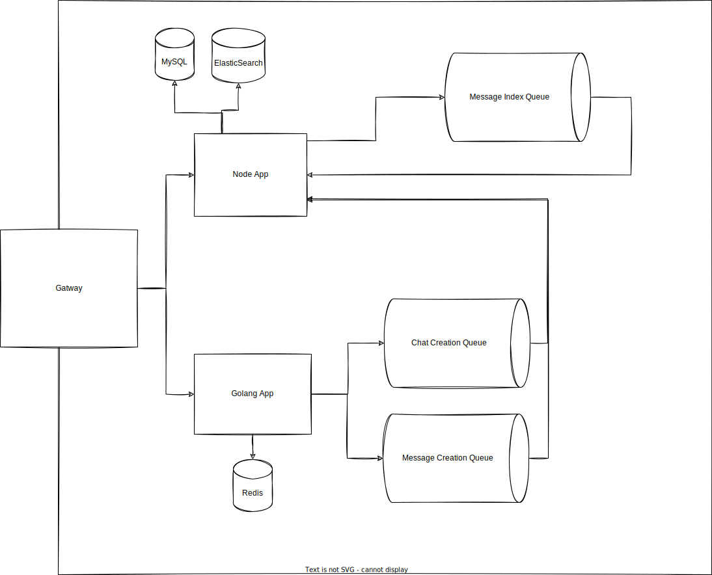

# Chats-challenge

Chats challenge is a system that create chatting systems.

The project is split into three main components:

1. [NodeApp](./nodeApp) a nodejs express app that manages workers, crons, most of crud.

2. [GolangApp](./golanApp/) A Golang service which handles Chat and Message creation requests.

3. [NginxGateway](./nginx/) A reverse proxy acts as a gateway to the system.  

## Getting Started

### Using docker-compose

- You need to have [docker](https://www.docker.com/) and [docker-compose](https://docs.docker.com/compose/) installed
- Run

  ```shell
   docker-compose up
   ```

- get a cup of coffee this is going to take a while
- when the compose command is done open your browser at <http://localhost:8080/api-docs> to explore the apis

## Architecture Diagram



## To Do

- [ ] Search Todo in the project comments
- [ ] Add more tests
- [ ] Add CI/CD pipeline  

### Want to help

1. Fork the project
2. Create your feature branch

    ```sh
    git checkout -b feature/add-magic
    ```

3. Commit your changes

    ```sh
    git commit -m 'Add some magic'
    ```

4. Push to the branch

    ```sh
    git push origin feature/add-magic
    ```

5. Open a pull request

## Authors

[Khaled-Abdelal](<https://www.linkedin.com/in/khaled-abdelal-a73b3a125/>
